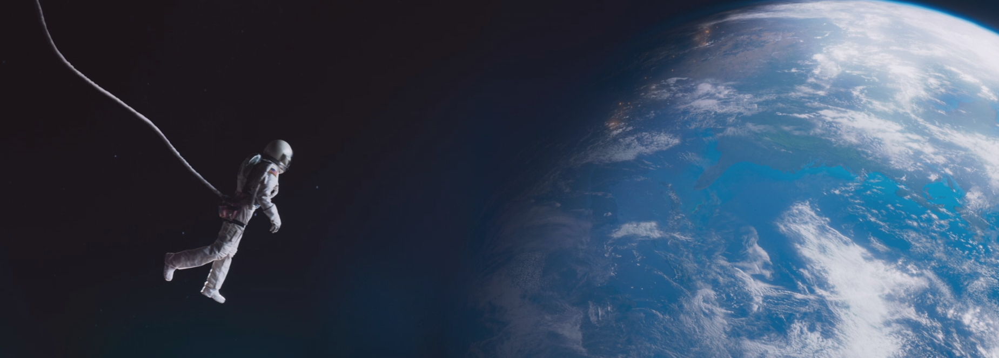

Lo que más me gusta es la programación de videojuegos retro para sistemas de 8 bits
Soy uno de los ganadores del concurso <a href="ttps://www.msxblog.es/concurso-40-aniversario-msx-basic-leo-must-live/">Concurso 40 aniversario MSX-BASIC</a>
después el desarrollo de aplicaciones móviles. Por último, las aplicaciones web php.
Y por supuesto "el espacio", que tranquilidad, ¿no?

 

What I like the most is the programming of retro video games for 8-bit systems

Después el desarrollo de aplicaciones para dispositivos móviles.

After the development of applications for mobile devices:

https://play.google.com/store/apps/details?id=es.tipolisto.msxquiz

https://play.google.com/store/apps/details?id=es.tipolisto.breeds

Por último las aplicaciones web php.

Finally the php web applications:

http://tipolisto.es/

http://msx.tipolisto.es/

https://audiotours.es/

 👋
 
Gracias por leerme.
Thanks for reading me.
